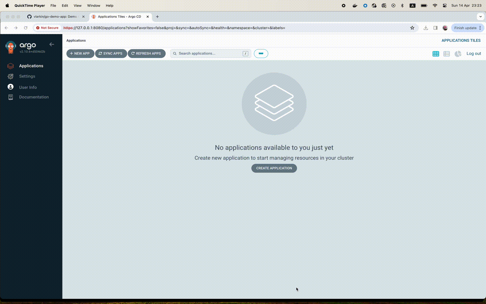

After demonstrating Argo CD using `hello world application` as an example, let's begin deploying an application provided by the developers. 

Fork a repository with the application so that we can make changes to it and check the automatic synchronization.

Log in to Argo CD API server and click **+ New App**

In **General** section, set application name to `go-demo-app`, use the project `default`, and set the sync policy `Automatic`. Also tick the `Auto create namespace` option.

In **Source** section, set the fork repository URL and Path to `helm` where the helm charts are stored.

For **Destination**, set the cluster URL to https://kubernetes.default.svc and
the namespace to `go-demo-app`.



Once the application is created, you can now view its status.


The full video of deploying an application provided by the developers

[](https://youtu.be/hfMHhPf1rI4)


When the application deployment finishes, check its response to queries using port forwarding. Let's use the `duck.jpeg` image for testing the application.

```
% kubectl get service/ambassador -n  go-demo-app
NAME         TYPE       CLUSTER-IP      EXTERNAL-IP   PORT(S)        AGE
ambassador   NodePort   10.43.147.117   <none>        80:30615/TCP   30m

% kubectl port-forward service/ambassador -n go-demo-app 8088:80 &

% curl http://localhost:8088/
Handling connection for 8088
k8sdiy-api:599e1af

% curl -F 'image=@duck.jpeg' http://localhost:8088/img/
```

[](https://asciinema.org/a/654185)

In `helm/values.yaml`, change the service type of the api-gateway from NodePort to LoadBalancer, and push the changes to the application's forked repository. Argo CD automatically applies the changes, and after some time, they appear in the Kubernetes cluster.

```
% kubectl get service/ambassador -n  go-demo-app
NAME         TYPE           CLUSTER-IP      EXTERNAL-IP   PORT(S)        AGE
ambassador   LoadBalancer   10.43.147.117   <pending>     80:30615/TCP   32m
```

[](https://asciinema.org/a/654189)
