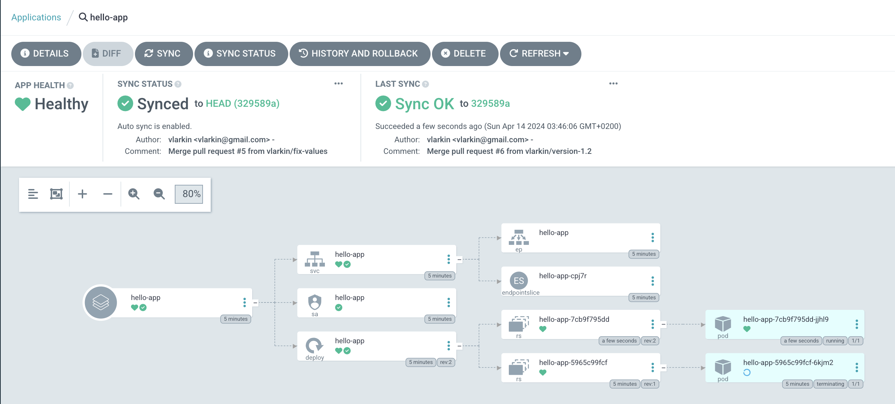

**Argo CD** is a declarative, GitOps continuous delivery tool for Kubernetes. It automates the deployment of applications to Kubernetes clusters by using Git repositories as the source of truth for application configurations. Argo CD compares the desired state defined in a Git repository with the current state of resources in a Kubernetes cluster and ensures that the cluster reflects the desired state.

## **Requirements**

Installed kubectl command-line tool and a kubeconfig file with a current cluster context.
Let's use lightweight k3d for deploying a Kubernetes cluster (this helps to avoid creating one more VM).

```
% k3d cluster create argo
% kubectl config current-context
k3d-argo
```

Credendieals in `docker.json` for accessing a private docker registry created in GCP Atrifact Registry.

## **Install Argo CD**

Create a new namespace ‘argocd’ and apply the manifests to your
Kubernetes cluster
```
kubectl create namespace argocd
kubectl apply -n argocd -f
https://raw.githubusercontent.com/argoproj/argo-cd/stable/manifests/install.yaml
```
## **Access The Argo CD API Server**

The default username is `admin`, and the password is auto-generated
and can be retrieved by running the following command

```
kubectl -n argocd get secret argocd-initial-admin-secret -o jsonpath="{.data.password}" | base64 -d && echo
```

Use port forward for providing an access to the Argo CD API Server

```
kubectl port-forward service/argocd-server -n argocd 8080:443
```

Check if the Argo CD API server is accessable

```
curl -k https://127.0.0.1:8080/
```

## **Create an Application from a Git repository**

Let’s deploy **hello-app** application listens on http port and responds 
with a pod name and the application version.

Create a namespace for the application

```
kubectl create namespace hello-app
```

In **hello-app** namespace create a secret for accessing docker images
stored in a private docker registry

```
kubectl create -n hello-app secret docker-registry artifact-registry \
--docker-server=https://europe-docker.pkg.dev \
--docker-email=docker@project-id.iam.gserviceaccount.com \
--docker-username=\_json_key \
--docker-password="\$(cat docker.json)"
```

Create a helm chart in the application source repository

```
helm create hello-app
```

In created helm chart **hello-app** edit values.yaml 

```
image:
  repository: europe-docker.pkg.dev/project-id/docker-images/hello-app
  pullPolicy: IfNotPresent
  tag: "1.1"

imagePullSecrets:
    - name: artifact-registry
```

Build a docker image with the application and push it to the docker registry. Then merge all changes into the main branch and update the source code repository stored in Github.

Open in a browser <https://127.0.0.1:8080/>, allow using a self signed certificate, log in to Argo CD API server using credentials obtained above.

Click the **+ New App**


Give your app the name `hello-app`, use the project `default`, and set the
sync policy as `Automatic`.


In **Source** set repository URL to https://github.com/vlarkin/hello-app
and Path to `hello-app` where is a helm chart stored.


For **Destination**, set cluster URL
to https://kubernetes.default.svc and
namespace to `hello-app`.


After filling out the information above, click **Create** at the top of
the UI to create the **hello-app** application.


Once the application is created, you can now view its status


Check if the application works using port forward
```
kubectl port-forward -n hello-app service/hello-app 8000:80

% curl http://127.0.0.1:8000 && echo
Hello from hello-app-5965c99fcf-6kjm2! Application version 1.1
```

## **Make changes in the application code and deploy new version**

Set new application version, build and push a new docker image.

Update values.yaml in the helm chart and push changes into the
source repository.

Argo CD automatically detects changes and deploys a new application
version.



Check a new version using port forward
```
kubectl port-forward -n hello-app service/hello-app 8000:80

volodymyr.larkin@H09XXM6W9W ~ % curl http://127.0.0.1:8000 && echo
Hello from hello-app-7cb9f795dd-jjhl9! Application version 1.2
```

After some time Argo CD clean ups the environment from the previous release


